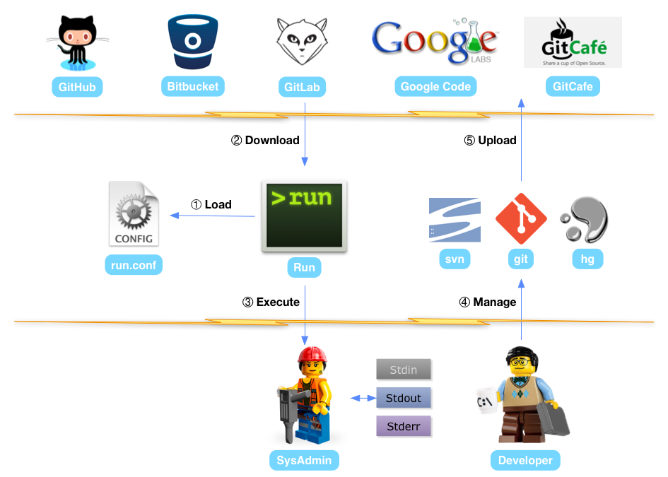

# Run

[](http://travis-ci.org/runscripts/run) [](https://godoc.org/github.com/runscripts/run) [](https://gitter.im/runscripts/run?utm_source=badge&utm_medium=badge&utm_campaign=pr-badge&utm_content=badge)

## Introduction

**Run** is the script manager for developers.

* It helps to manage scripts with git, svn or hg.
* It helps to re-use all your scripts naturally.
* It is highly integrated with GitHub and others.
* If you're writing scrips, please try it now!

## How It Works



After installing run, we can execute `run pt-summary` or `run github:runscripts/scripts/pt-summary`.

The command `run` will download the well-known [pt-summary](http://www.percona.com/doc/percona-toolkit/2.1/pt-summary.html) from GitHub and run locally.

You can manage your scripts with `svn`, `git` or `hg` in GitHub, Bitbucket, GitLab or anywhere.

## Install

* From Scratch (Go 1.3+)

  ```
  sudo GOPATH=$GOPATH make install
  ```

* From Binary

  Operating System | Architectures
  ---------------- | -------------
  Linux            | [386](https://raw.githubusercontent.com/runscripts/run-release/master/0.3.6/linux_386/run), [amd64](https://raw.githubusercontent.com/runscripts/run-release/master/0.3.6/linux_amd64/run), [arm](https://raw.githubusercontent.com/runscripts/run-release/master/0.3.6/linux_arm/run)
  Mac OS           | [386](https://raw.githubusercontent.com/runscripts/run-release/master/0.3.6/darwin_386/run), [amd64](https://raw.githubusercontent.com/runscripts/run-release/master/0.3.6/darwin_amd64/run), [brew](https://github.com/tobegit3hub/homebrew-run)
  FreeBSD          | [386](https://raw.githubusercontent.com/runscripts/run-release/master/0.3.6/freebsd_386/run), [amd64](https://raw.githubusercontent.com/runscripts/run-release/master/0.3.6/freebsd_amd64/run)
  Debian/Ubuntu    | [386](https://raw.githubusercontent.com/runscripts/run-release/master/0.3.6/deb/run_20141224-0.3.6_386.deb), [amd64](https://raw.githubusercontent.com/runscripts/run-release/master/0.3.6/deb/run_20141224-0.3.6_amd64.deb)

  Download the binary according to your OS and place it in **$PATH** (like /usr/bin/). Then execute `sudo run --init` or `sudo dpkg -i run.deb`.
  
## Usage

Watch the [one-minute video](https://www.youtube.com/watch?v=WXUcJvrZP6M) before you're using it.

```
Usage:
	run [OPTION] [SCOPE:]SCRIPT

Options:
	-c, --clean     clean out all scripts cached in local
	-h, --help      show this help message, then exit
	-i INTERPRETER  run script with interpreter(e.g., bash, python)
	-I, --init      create configuration and cache directory
	-u, --update    force to update the script before run
	-v, --view      view the content of script, then exit
	-V, --version   output version information, then exit

Examples:
	run pt-summary
	run github:runscripts/scripts/pt-summary

Report bugs to <https://github.com/runscripts/run/issues>.
```

## Scripts

At beginning, we can try `run pt-summary` and checkout official scripts in [runscripts/scripts](https://github.com/runscripts/scripts).

Now let's manage all the scripts with version control tools and play with this script manager.

Feel free to send pull-request to official scripts and contribute to [runscripts.org](http://runscripts.org/).
